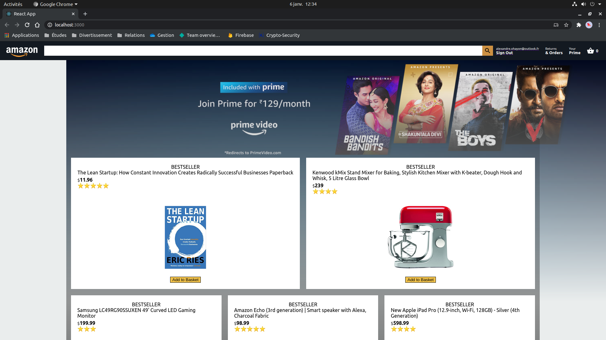
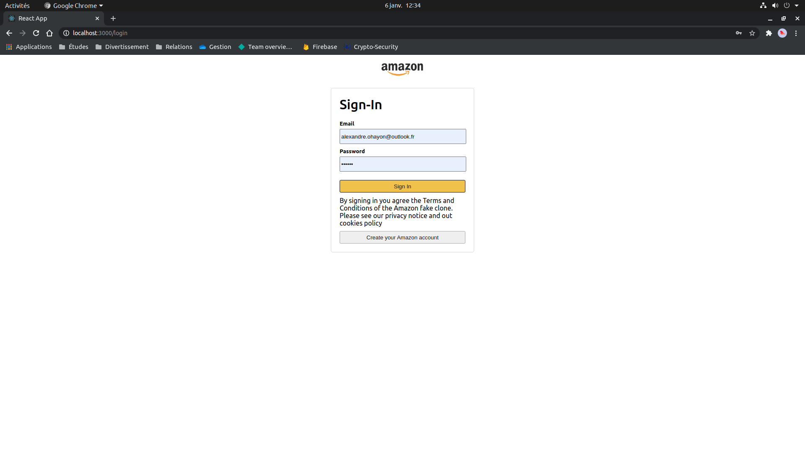
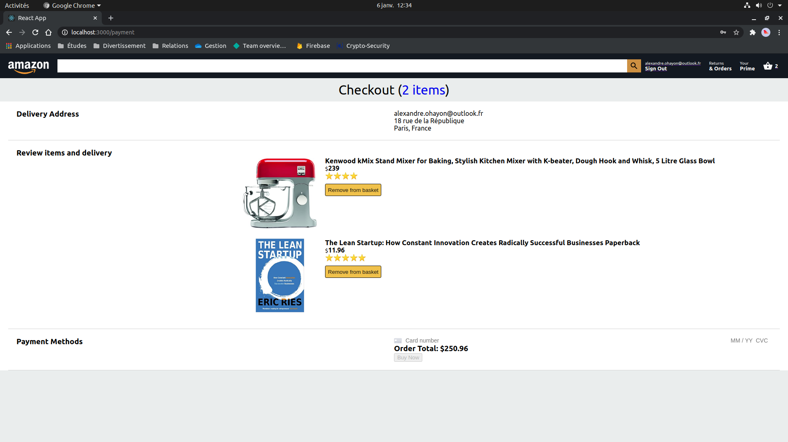

## Available Scripts

In the project directory, you can run:

### `npm install && npm start`

Runs the app in the development mode.\
Open [http://localhost:3000](http://localhost:3000) to view it in the browser.

# Usage

App is deployed at https://my-c1cb2.web.app/

## Screenshot

